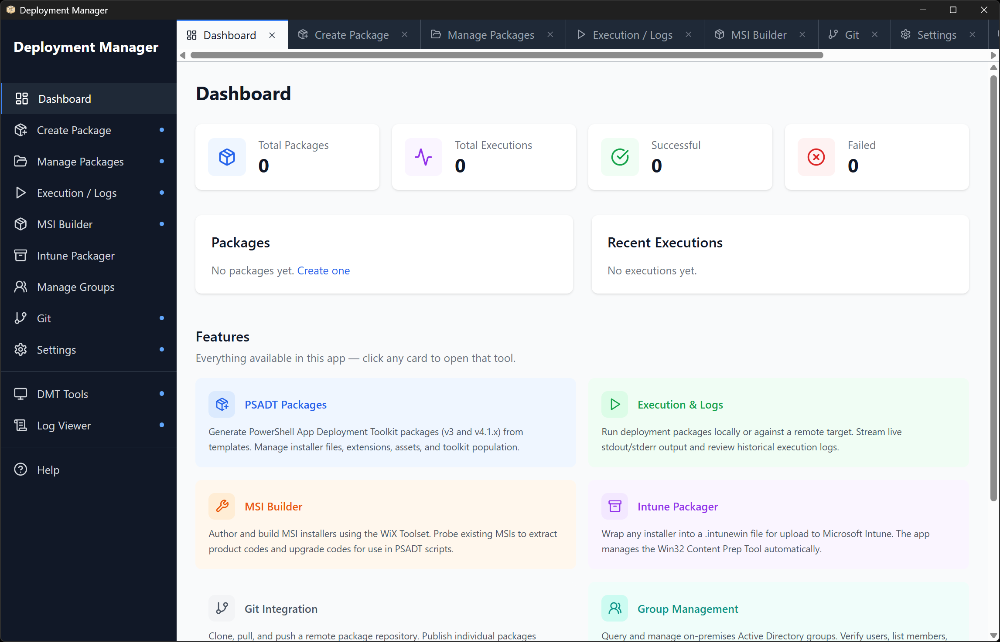
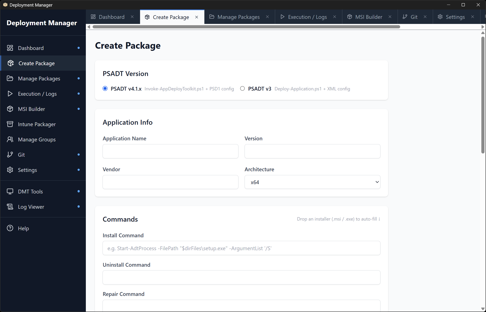
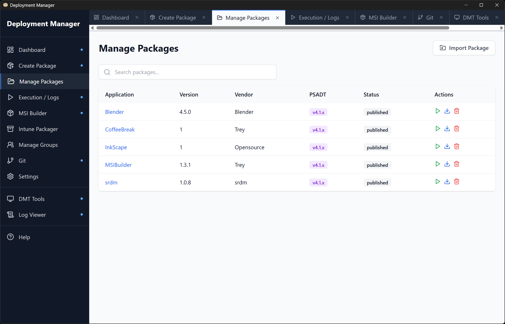
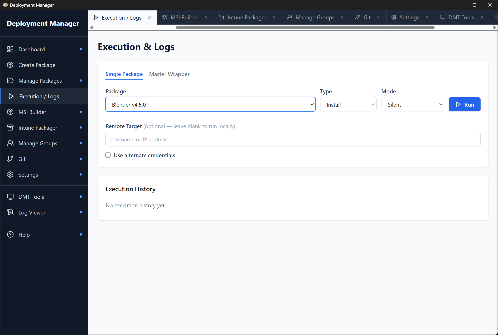
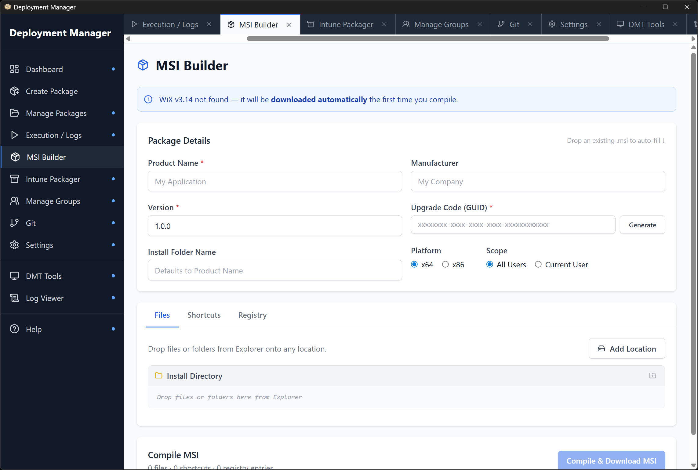
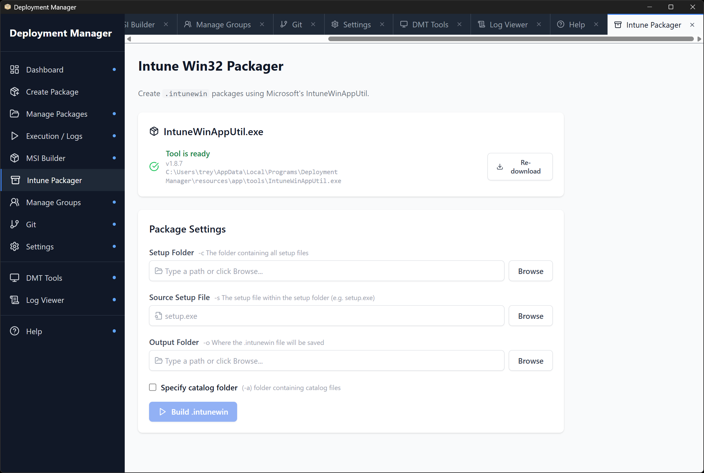
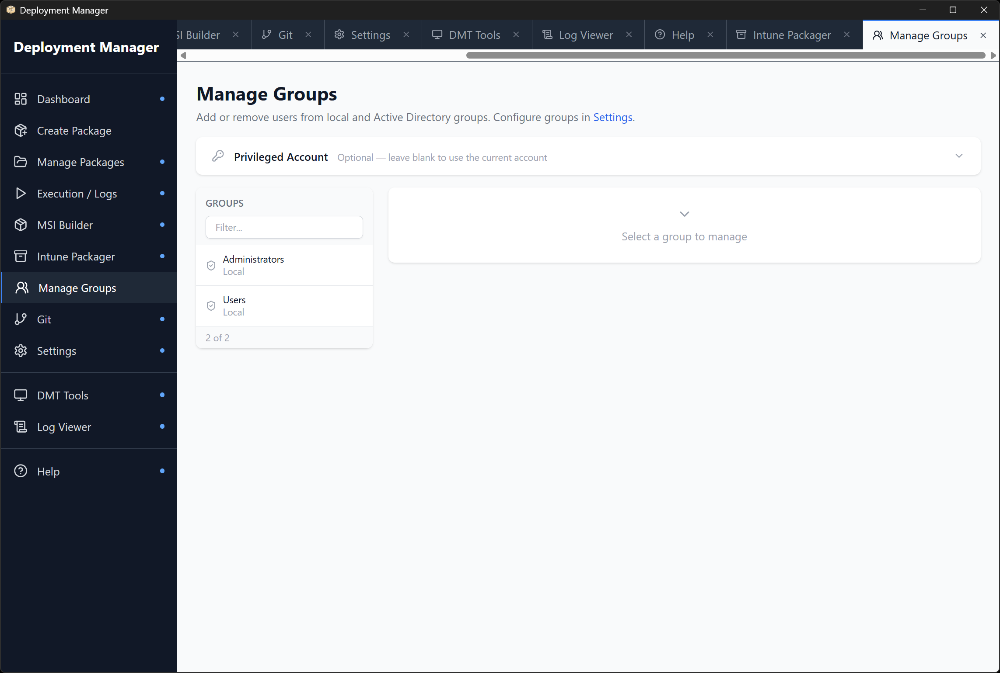
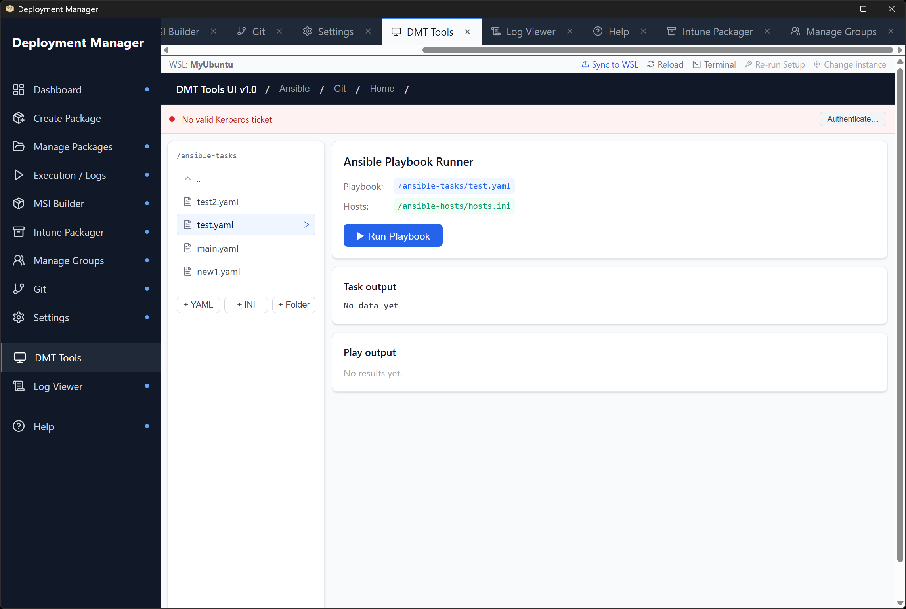
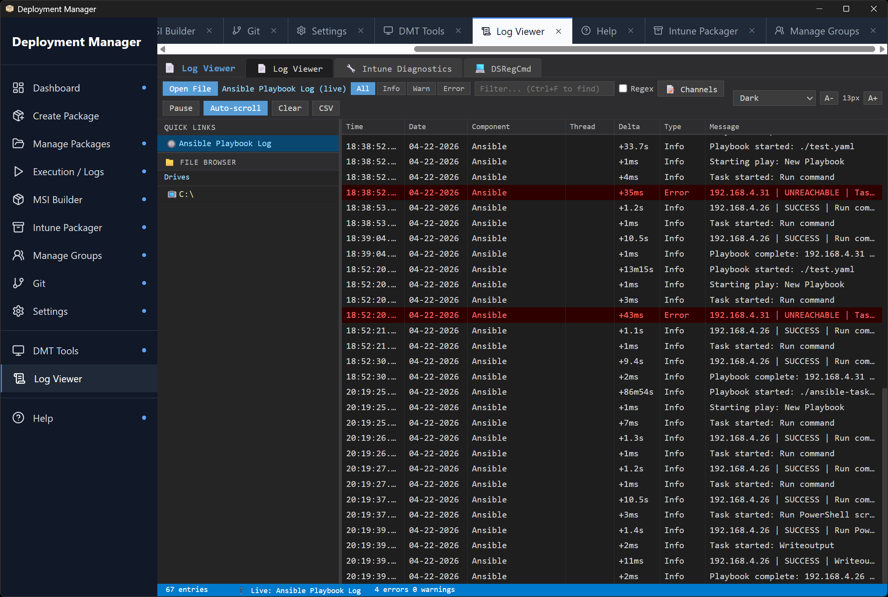

# Deployment Manager

A modern, web-based desktop application for building, managing, and deploying
[PowerShell App Deployment Toolkit (PSADT)](https://psappdeploytoolkit.com/) packages — plus a full
suite of Windows IT administration tools. Runs as a standalone **Electron** desktop app or as a
browser-accessible **web application**.

> **Disclaimer:** Claude Sonnet was used to generate some of the code and to assist in refactoring
> human-written code. The code has been thoroughly reviewed, but bugs or typos may still exist.

---

## Overview

Deployment Manager replaces the old "edit PowerShell scripts by hand" workflow with a clean browser
UI. It supports both PSADT **v3** and **v4.1.x**, generates version-appropriate scripts from
Handlebars templates, streams live execution output over WebSocket, and bundles several Windows
administration tools under one roof.

The interface uses a **persistent tabbed layout** — every page you open stays alive in its own tab.
Switching tabs never resets state: a running Ansible playbook, a live log tail, or a half-filled
form all remain exactly where you left them.

---

## Features

### Tabbed Interface

- Every nav item opens in a persistent tab — components are never unmounted when you switch away
- Tabs show a blue dot indicator when open in the background
- Close individual tabs with the × button; a confirmation dialog appears if a tab has unsaved credentials
- Active tab scrolls into view automatically when selected from the sidebar
- Dashboard is always the first tab on startup



### Package Builder

- Form-driven interface for creating PSADT deployment packages
- **PSADT v3** and **v4.1.x** support — select the version per package; scripts and cmdlets are generated accordingly
- Fields for application name, version, vendor, architecture, install / uninstall / repair commands, close-applications list, and default deploy mode
- **Drag-and-drop installer auto-fill** — drop an `.msi` or `.exe` onto the Commands panel to auto-populate install/uninstall commands with the correct syntax; the installer is automatically uploaded to `Files\` on save
- Detection rule builder: file path, registry key/value, MSI product code, or custom PowerShell script
- Pre-install and post-install step editor (description + PowerShell command pairs)
- Deployment conditions (OS version, architecture, custom)



### Package Management

- Browse, search, and filter all packages in the packages directory
- View package details, edit any field, and regenerate scripts on demand
- File manager per package: upload additional files, delete files, detect missing installer references
- Import existing PSADT packages from the filesystem
- Delete packages with confirmation



### Script Generation

- Handlebars template engine generates version-appropriate scripts:
  - **v3:** `Deploy-Application.ps1` + `AppDeployToolkitConfig.xml`
  - **v4:** `Invoke-AppDeployToolkit.ps1` + `Config.psd1`
- Scripts are regenerated on every save or on demand

### Execution Engine

- Run packages locally or on a **remote target** via WinRM
  - Remote execution copies package files to a temp directory, runs the deployment, then cleans up
  - Optional username / password for WinRM authentication
- **Master Wrapper** — chain multiple packages into a single ordered deployment sequence with per-step install/uninstall/repair and mode selection
- Three deployment modes: Silent, Interactive, NonInteractive
- Real-time **WebSocket log streaming** — stdout and stderr colour-coded in a live terminal panel
- Execution history with status badges (Running / Success / Failed) and a full log viewer modal



### Script Runner

Auto-generates a point-and-click form UI from any PowerShell script's `param()` block, streams live output, and displays pipeline return values as a resizable table. The scripts folder is configured in Settings.

- **Auto-detected parameter types** — `[string]`, `[switch]`/`[bool]`, `[int]`, `[double]`, `[datetime]`, `[ValidateSet(...)]` (dropdown), and password-style fields (masked)
- **Parameter options file** — place a `.json` file with the same base name as the script in the same folder to get combobox inputs with preset values (see format below)
- **Linked parameters** — selecting a preset can auto-fill other parameters in the same form
- **Structured output tab** — pipeline objects are captured and rendered as a table with resizable columns
- **Microsoft Graph integration** — install and connect `Microsoft.Graph` from the UI; optionally inject the connection before every script run
- **Azure (Az) integration** — install and connect `Az` from the UI; optionally inject the Az context before every script run

#### Parameter options file format

Create `ScriptName.json` in the same folder as `ScriptName.ps1`.

**Simple list of preset values:**

```json
{
  "ResourceGroupName": [
    "prod-rg-eastus-01",
    "staging-rg-eastus-01"
  ],
  "HostPoolName": [
    "prod-hostpool-01",
    "staging-hostpool-01"
  ]
}
```

**Presets that auto-fill other parameters** — use an object with a `"value"` key plus any other parameter names as keys. Selecting that option fills the linked fields automatically; a tooltip shows what will be set.

```json
{
  "ResourceGroupName": [
    "staging-rg-eastus-01",
    {
      "value": "prod-rg-eastus-01",
      "HostPoolName": "prod-hostpool-01"
    }
  ],
  "HostPoolName": [
    "staging-hostpool-01",
    {
      "value": "prod-hostpool-01",
      "ResourceGroupName": "prod-rg-eastus-01"
    }
  ]
}
```

> Trailing commas are allowed — the parser strips them automatically.

### MSI Builder

- Build custom Windows Installer (`.msi`) packages from scratch using WiX v3
- **Drag-and-drop MSI probing** — drop an existing `.msi` to auto-fill product name, manufacturer, version, upgrade code, product code, and platform
- **Multi-destination file tree** — install files to any system location (ProgramData, System32, AppData, custom paths, and more)
- **Drag-and-drop folder import** — drag an entire folder onto the file tree to recursively recreate the structure
- Inline folder renaming — double-click any folder to rename it in place
- **Windows Service support** — mark any `.exe` as a service with full property editing: name, display name, startup type, Log On As account, and install/start/stop/remove actions
- Registry editor with expandable entry views
- Auto-detects WiX toolset; surfaces install instructions if missing



### Intune Win32 Packager

- Create `.intunewin` packages using Microsoft's **IntuneWinAppUtil.exe**
- **Automatic tool management** — downloads the latest release from the official [Microsoft GitHub repository](https://github.com/microsoft/microsoft-win32-content-prep-tool) if not cached
- Form fields for setup folder, source file, and output folder with native folder/file picker dialogs
- Options: quiet mode and catalog folder
- Live command preview and real-time build output



### Code Signing

- Authenticode-sign any supported file (`.exe`, `.dll`, `.msi`, `.cab`, `.ps1`, `.psm1`, `.sys`, `.appx`, `.msix`, and more) using PowerShell's built-in `Set-AuthenticodeSignature` — no Windows SDK or `signtool.exe` required
- **Drag-and-drop or browse** for the file to sign
- **Certificate store** — paste a thumbprint from `certmgr.msc`; the app searches both `LocalMachine\My` and `CurrentUser\My`
- **PFX file** — browse for a `.pfx` or `.p12` file and enter its password; the file is used only for the signing operation and never persisted to disk
- Configurable **timestamp server** (defaults to DigiCert) so signatures remain valid after the certificate expires
- The signed file is downloaded with its original filename
- MSI Builder also has an integrated optional signing step that fires immediately after the WiX compile

### Manage Groups

- Manage Windows **local groups** and **Active Directory domain groups** from one UI
- Searchable, scrollable group sidebar with real-time filter
- **Add user workflow:** enter username → verify (confirms account exists, checks existing membership) → confirm add
- **Remove user workflow:** click Remove → inline confirmation with user details → confirm remove
- **Privileged account support** — enter an AD admin account for operations requiring elevated rights; credentials are session-persistent but never written to disk



### Git Integration

- Clone, pull, push, and view log for a configurable PSADT package repository
- Publish individual packages directly from their detail view
- Displays current branch, ahead/behind counts, and recent commit history
- **Optional push credentials** — expand the Credentials section to supply a username and password or personal access token at push time; credentials are kept only in the tab's memory and never written to `.git/config` or disk
- Closing the Git tab while credentials are entered prompts for confirmation

### DMT Tools

- Embeds the **Ansible DMT Tools** web app (running inside WSL) directly in the UI
- Run Ansible playbooks against Windows endpoints from the browser without switching to a terminal
- Integrated WSL terminal — open a shell in your WSL instance without leaving the app
- One-click **Sync to WSL** — rsyncs source files, rebuilds the React frontend, and restarts the Node server; the embedded frame reloads automatically
- WSL instance selector with automatic setup detection (Node.js, Ansible, Python venv)



### Log Viewer

- Real-time **CMTrace log viewer** — the same format used by SCCM/ConfigMgr and PSADT
- Supports CMTrace structured format, SCCM Simple (`$$<`) format, plain text, and **EVTX** Windows Event Log files
- **File browser** — navigate drives and directories on the server to open any supported log file
- **Live tail** — files are watched with chokidar; new lines stream in automatically via Socket.IO
- **Ansible Playbook Log quick-link** — one click loads and tails `/tmp/ansible_cmtrace.log` from the ansible-app server in real time, polling every 3 seconds as a playbook runs; keep this tab open alongside DMT Tools for a live feed
- Severity filter (All / Info / Warn / Error), text filter with regex support, Ctrl+F find bar
- Column resize (widths saved to localStorage), theme selector, font size controls, CSV export
- **Intune Diagnostics tab** — parse `IntuneManagementExtension.log` into a structured timeline
- **DSRegCmd tab** — paste `dsregcmd /status` output for instant Azure AD join state analysis



### Settings

- Repository URL and local path
- Packages base directory
- Server port
- PowerShell executable path
- Active Directory domain name for AD group operations
- Managed groups list — add local or domain groups with live verification

---

## Tech Stack

| Layer | Technology |
|---|---|
| Frontend | React 18, Vite, Tailwind CSS, React Router, Lucide icons |
| Backend | Node.js, Express 4 |
| Real-time (execution) | WebSocket (`ws`) |
| Real-time (log viewer) | Socket.IO, chokidar |
| Templating | Handlebars |
| Desktop | Electron 41 |
| MSI build | WiX v3 toolset (external) |
| Intune packaging | IntuneWinAppUtil (auto-downloaded) |
| Group management | PowerShell (`Get/Add/Remove-LocalGroupMember`, AD cmdlets) |
| Git | simple-git |

---

## Project Structure

```
aipsadt/
├── ansible-app/                  # Ansible DMT Tools web app (deployed to WSL)
│   ├── app.js                    # Express server (port 7000) with Ansible playbook execution
│   ├── callback_plugins/
│   │   └── cmtrace.py            # Ansible callback: writes CMTrace-format log to /tmp/
│   └── my-react-app/             # Ansible UI frontend
├── client/                       # React frontend (Vite, port 3000 in dev)
│   └── src/
│       ├── context/              # ConfigContext, AdCredentialContext, TabGuardContext
│       ├── hooks/                # useWebSocket
│       ├── pages/                # One file per page/feature
│       └── api.js                # All API client functions
├── electron/
│   ├── main.js                   # Electron main process, IPC handlers, external link routing
│   └── preload.js                # Context bridge (pickFolder, pickFile)
├── server/
│   ├── controllers/              # Request handlers
│   ├── logviewer/                # Log Viewer backend (routes + Socket.IO tail watcher)
│   │   └── public/               # Log Viewer static frontend (served at /logviewer)
│   ├── routes/                   # Express route definitions
│   ├── services/                 # Business logic
│   │   ├── executionService.js
│   │   ├── gitService.js
│   │   ├── groupService.js
│   │   ├── intuneService.js
│   │   ├── logStream.js
│   │   ├── msiService.js         # Also exports signMsi used by Code Signing
│   │   └── packageService.js
│   ├── index.js                  # Express app, WebSocket server, Socket.IO
│   └── paths.js                  # Path resolution (dev vs packaged)
├── templates/
│   ├── v3/                       # PSADT v3 Handlebars templates
│   └── v4/                       # PSADT v4.1.x Handlebars templates
├── screenshots/                  # UI screenshots for documentation
└── config.json                   # Runtime configuration
```

---

## Setup

### Prerequisites

- **Node.js** 18 or later
- **Windows** (required for PSADT execution, group management, and MSI building)
- **WiX Toolset v3.14** — required only for MSI Builder (`candle.exe` and `light.exe` must be on PATH or in `C:\Program Files (x86)\WiX Toolset*`)
- **WSL** with Ubuntu 24.04 — required only for DMT Tools / Ansible integration

### Install dependencies

```bash
# Root (backend + Electron)
npm install

# Frontend
cd client && npm install
```

### Development

```bash
# Web (backend on :4000, frontend on :3000 with proxy)
npm run dev

# Electron desktop app
npm run electron:dev
```

### Production build

```bash
# Build React client
npm run build:client

# Serve via Express (web mode)
npm start

# Package as Electron installer (NSIS + portable)
npm run electron:build

# Package as unpacked directory
npm run electron:pack
```

---

## Configuration

Edit `config.json` in the project root (or `%APPDATA%\DMTPSADT\config.json` when packaged):

```json
{
  "repository": {
    "url": "https://github.com/your-org/psadt-packages.git",
    "localPath": "./repo"
  },
  "packages": {
    "basePath": "./packages"
  },
  "server": {
    "port": 4000
  },
  "execution": {
    "powershellPath": "powershell.exe",
    "defaultArgs": ["-NoProfile", "-ExecutionPolicy", "Bypass"]
  },
  "groups": {
    "adDomain": "contoso.com",
    "managedGroups": [
      { "name": "Administrators", "type": "local" },
      { "name": "Domain Admins",  "type": "domain" }
    ]
  }
}
```

---

## API Reference

All endpoints are under `/api`.

| Method | Path | Description |
|--------|------|-------------|
| GET | `/packages` | List all packages |
| POST | `/packages` | Create a package |
| GET | `/packages/:app/:ver` | Get package detail |
| PUT | `/packages/:app/:ver` | Update package |
| DELETE | `/packages/:app/:ver` | Delete package |
| POST | `/packages/:app/:ver/regenerate` | Regenerate scripts |
| POST | `/packages/:app/:ver/upload` | Upload files |
| GET | `/packages/:app/:ver/files` | List uploaded files |
| DELETE | `/packages/:app/:ver/files/:name` | Delete a file |
| POST | `/execution/run` | Run a package (local or remote) |
| POST | `/execution/run-wrapper` | Run master wrapper sequence |
| GET | `/execution/logs` | List execution history |
| GET | `/execution/logs/:id` | Get a specific log |
| GET | `/git/status` | Git status |
| POST | `/git/clone` | Clone repository |
| POST | `/git/pull` | Pull latest |
| POST | `/git/push` | Push changes (accepts optional `username`/`password`) |
| GET | `/msi/detect-tools` | Check WiX installation |
| POST | `/msi/probe` | Extract metadata from an MSI |
| POST | `/msi/build` | Build an MSI package |
| GET | `/intune/status` | Check IntuneWinAppUtil cache |
| POST | `/intune/download` | Download IntuneWinAppUtil |
| POST | `/intune/build` | Create .intunewin package |
| POST | `/sign/file` | Authenticode-sign an uploaded file and return it |
| POST | `/groups/verify-group` | Verify a group exists |
| POST | `/groups/members` | List group members |
| POST | `/groups/verify-user` | Verify a user exists |
| POST | `/groups/add-user` | Add user to group |
| POST | `/groups/remove-user` | Remove user from group |
| GET | `/config` | Get configuration |
| PUT | `/config` | Update configuration |
| GET | `/api/browse` | Log Viewer file browser |
| GET | `/api/read` | Log Viewer: read and parse a log file |
| POST | `/api/parse` | Log Viewer: parse posted log content |
| GET | `/api/evtx` | Log Viewer: parse EVTX file or channel |
| GET | `/logs/cmtrace` | ansible-app: stream CMTrace log (port 7000) |
| GET | `/scripts/browse` | Script Runner: list scripts/folders |
| GET | `/scripts/parse` | Script Runner: parse a script's param() block + load options file |
| POST | `/scripts/run` | Script Runner: run a script (SSE stream) |
| GET | `/scripts/mggraph/status` | Script Runner: check Microsoft.Graph installation |
| POST | `/scripts/mggraph/install` | Script Runner: install Microsoft.Graph (SSE stream) |
| POST | `/scripts/mggraph/connect` | Script Runner: Connect-MgGraph (SSE stream) |
| POST | `/scripts/mggraph/disconnect` | Script Runner: Disconnect-MgGraph |
| GET | `/scripts/az/status` | Script Runner: check Az.Accounts installation |
| POST | `/scripts/az/install` | Script Runner: install Az module (SSE stream) |
| POST | `/scripts/az/connect` | Script Runner: Connect-AzAccount (SSE stream) |
| POST | `/scripts/az/disconnect` | Script Runner: Disconnect-AzAccount |

**WebSocket endpoints** (port 4000):

| Path | Description |
|------|-------------|
| `ws://localhost:4000/ws/logs` | Execution log streaming. Send `{ "subscribe": "<id>" }` to filter to a run. |
| `ws://localhost:4000/ws/terminal` | Integrated WSL terminal (DMT Tools) |
| `ws://localhost:4000/socket.io` | Log Viewer real-time tail (Socket.IO) |

---

## PSADT Version Reference

| Feature | v3 | v4.1.x |
|---|---|---|
| Entry script | `Deploy-Application.ps1` | `Invoke-AppDeployToolkit.ps1` |
| Config file | `AppDeployToolkitConfig.xml` | `Config.psd1` |
| Install prompt | `Show-InstallationWelcome` | `Show-ADTInstallationWelcome` |
| Run process | `Execute-Process` | `Start-ADTProcess` |
| Run MSI | `Execute-MSI` | `Start-ADTMsiProcess` |
| Log entry | `Write-Log` | `Write-ADTLogEntry` |
| Progress dialog | `Show-InstallationProgress` | `Show-ADTInstallationProgress` |
| Session open | *(implicit)* | `Open-ADTSession` |
| Session close | `Exit-Script` | `Close-ADTSession` |

---

## License

MIT
